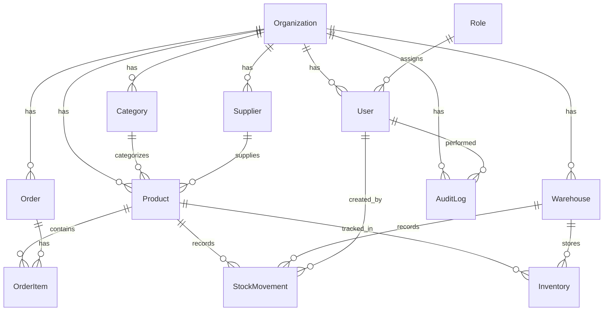

# System Architecture — StockPilot IMS v2.0

## Overview

StockPilot is a multi-tenant inventory management platform built on a **layered** architecture. The frontend (Next.js 14) communicates with the backend (FastAPI) over REST, and all data is persisted in SQLite with full organization-based isolation.

---

## High-Level Architecture

```
┌─────────────────────────────────────────────────────────────┐
│                        Frontend                             │
│  Next.js 14 · App Router · TypeScript · Glassmorphism UI    │
│                                                             │
│  ┌─────────┐  ┌──────────────┐  ┌────────────────────────┐ │
│  │ Pages   │  │ Components   │  │ Lib                    │ │
│  │ (App/)  │  │ (AppShell)   │  │ api-client.ts          │ │
│  │         │  │              │  │ auth-storage.ts        │ │
│  └────┬────┘  └──────┬───────┘  └────────┬───────────────┘ │
│       └──────────────┴───────────────────┘                  │
│                       │ Axios (REST)                        │
└───────────────────────┼─────────────────────────────────────┘
                        │
┌───────────────────────┼─────────────────────────────────────┐
│                    Backend                                   │
│  FastAPI · Python 3.11+ · SQLAlchemy 2.0 · Pydantic v2      │
│                                                             │
│  ┌──────────────────────────────────────────────────────┐   │
│  │                  API Layer (v1/)                      │   │
│  │  auth · products · orders · inventory · warehouses   │   │
│  │  suppliers · categories · users · org · audit        │   │
│  └──────────────────────┬───────────────────────────────┘   │
│                         │                                    │
│  ┌──────────────────────┼───────────────────────────────┐   │
│  │              Core Layer                              │   │
│  │  deps.py (RBAC + org-scope)                          │   │
│  │  security.py (JWT + bcrypt)                          │   │
│  │  config.py (env settings)                            │   │
│  └──────────────────────┬───────────────────────────────┘   │
│                         │                                    │
│  ┌──────────────────────┼───────────────────────────────┐   │
│  │            Services Layer                            │   │
│  │  bootstrap.py (role seeding)                         │   │
│  │  audit_service.py (action logging)                   │   │
│  └──────────────────────┬───────────────────────────────┘   │
│                         │                                    │
│  ┌──────────────────────┼───────────────────────────────┐   │
│  │         Data Layer (SQLAlchemy + SQLite)              │   │
│  │  Organization · User · Role · Product · Category     │   │
│  │  Supplier · Warehouse · Inventory · StockMovement    │   │
│  │  Order · OrderItem · RefreshToken · AuditLog         │   │
│  └──────────────────────────────────────────────────────┘   │
└─────────────────────────────────────────────────────────────┘
```

---

## Multi-Tenancy Model

All entities are scoped to an **Organization** via `org_id` foreign key:

```
Organization (id, name, slug)
  ├── Users (org_id)
  ├── Products (org_id)
  ├── Warehouses (org_id)
  ├── Orders (org_id)
  ├── Suppliers (org_id)
  ├── Categories (org_id)
  └── AuditLogs (org_id)
```

**Isolation mechanism**: Every API endpoint adds `.filter(Model.org_id == current_user.org_id)` to queries. The `org_id` is embedded in the JWT token and retrieved from the authenticated user's database record.

---

## Authentication Flow

```
1. CREATE ORG → POST /auth/org/create
   Creates Organization + Owner User → Returns JWT pair

2. LOGIN → POST /auth/login
   Requires: org_slug + email + password
   Returns: access_token (24h) + refresh_token (7d)
   Token payload: { sub: user_id, org_id, type, jti }

3. INVITE → POST /auth/invite (owner/admin only)
   Creates user in the caller's org with specified role

4. REFRESH → POST /auth/refresh
   Rotates refresh token (old one revoked)

5. LOGOUT → POST /auth/logout
   Revokes refresh token
```

---

## RBAC System

### Hierarchy

```
owner (level 0) → admin (level 1) → manager (level 2) → staff (level 3)
```

### Implementation

- **`deps.py`** contains `ROLE_PERMISSIONS` — a dict mapping role names to sets of scope strings
- **`require_scope(*scopes)`** — FastAPI dependency that checks if the current user's role has all required scopes
- **Scope format**: `resource:action` (e.g., `products:delete`, `inventory:transfer`)
- **Client-side**: `auth-storage.ts` mirrors the permission matrix for UI conditional rendering

### Hierarchy enforcement

- Users cannot assign a role with a lower `level` number (higher privilege) than their own
- Users cannot delete themselves
- Delete user = soft-delete (deactivation)

---

## Database Schema (ERD)



---

## Frontend Architecture

### Design System

- **CSS Custom Properties** for tokens (colors, radii, shadows, fonts)
- **Glassmorphism** panels with `backdrop-filter: blur()`
- **Gradient mesh** background using layered radial gradients
- **Light/Dark mode** via `[data-theme]` attribute
- **Tailwind CSS** for utility classes

### Page Pattern

Each page follows a consistent pattern:
1. Import `AppShell` wrapper
2. Check scopes via `hasScope()` for conditional UI
3. Fetch data from API on mount
4. Render forms (create/edit) and data tables
5. Handle errors with inline messages

### State Management

- **Local state only** — No global store; each page manages its own state
- **Auth state** in `localStorage` + cookies for SSR middleware
- **Session info** (orgSlug, orgName, userRole) persisted alongside tokens

---

## Audit System

Every write operation calls `audit_service.log_action()` which records:

| Field          | Description                    |
|----------------|--------------------------------|
| `org_id`       | Organization scope             |
| `user_id`      | Who performed the action       |
| `action`       | create, update, delete, etc.   |
| `resource_type`| product, order, user, etc.     |
| `resource_id`  | ID of the affected resource    |
| `details`      | Human-readable description     |
| `created_at`   | Timestamp (UTC)                |

---

## Deployment Considerations

- **SQLite** is the default database — single-file, zero setup
- **PostgreSQL migration**: Change `DATABASE_URL` in `.env` and install `psycopg2`
- **CORS**: Configure `CORS_ORIGINS` for production domains
- **JWT Secret**: Set a strong `JWT_SECRET_KEY` in production
- **HTTPS**: Enforce via reverse proxy (nginx, Caddy)
